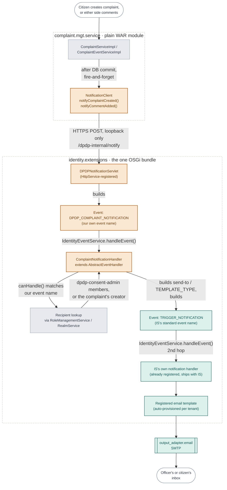
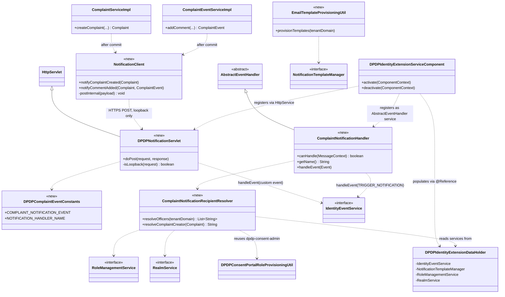
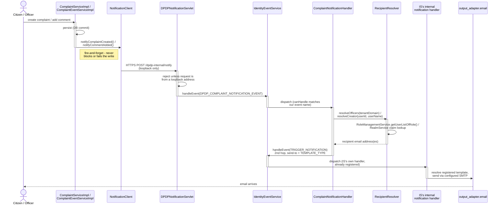

# Wiring email into the complaint feature

**Feature:** Complaint notifications
**Status:** Approved plan, in implementation
**Touches:** `complaint.mgt.service` · `identity.extensions`

How a create-complaint or add-comment call, sitting in a plain servlet WAR with no path to
WSO2 IS's notification machinery, ends up as a real templated email — by crossing into the
repo's one OSGi bundle and firing the same event chain IS uses for its own account emails.

## 1. The problem

The complaint feature — create a complaint, comment on it — has no notification of any kind
today. The ask is simple: email the officer when a citizen files a complaint, and email
whichever side didn't just speak, whenever a comment lands.

The implementation isn't simple, because of where the code that needs to send mail actually
lives.

**Where complaints happen.** `org.wso2.dpdp.accelerator.complaint.mgt.endpoint` is a plain,
non-OSGi Jersey servlet WAR, dropped straight into IS's Tomcat. It decodes JWTs in-process,
talks to its own database directly, and never touches Carbon or OSGi — by design.

**Where IS's mail machinery lives.** Sending a real, templated email means calling
`IdentityEventService` — an OSGi service. It's reachable from exactly one place in this repo:
`org.wso2.dpdp.accelerator.identity.extensions`, the only OSGi bundle here.

So the write and the send happen in two different deployables that don't share a classloader.
Everything below is the shape of the bridge between them.

## 2. Architecture

A complaint write commits inside the service module first — the notification is a
fire-and-forget step tacked on *after* that commit, never inside its transaction. From there the
call crosses the WAR/bundle boundary over loopback HTTP, then travels through two distinct
identity-event hops before IS's own mail sender ever sees it.

Legend: 🟠 new code (this feature) · ⚪ existing code (reused) · 🟢 IS / OSGi framework

*The write and the send live in different deployables. The only line crossing that boundary is
one loopback HTTPS call from the service module into a servlet registered by the bundle —
everything after that is in-process OSGi event dispatch.*

## 3. Why two events, not one

FSA's own CIBA weblink feature — the closest real precedent for this pattern on WSO2 IS —
extends a class called `DefaultNotificationHandler` and then throws away everything it
inherits, replacing `handleEvent()` entirely with a custom SMS call. We looked for that class to
extend the same way. It lives in a separate artifact,
`org.wso2.carbon.identity.event.handler.notification`, that isn't resolvable against this
project's dependency set at a version we could verify.

Rather than depend on a jar we can't confirm, `ComplaintNotificationHandler` extends the plain
`AbstractEventHandler` base that's already confirmed present, resolves the recipient itself, and
then fires a *second* event — `TRIGGER_NOTIFICATION`, IS's own standard name — which IS's
already-running internal handler picks up and turns into an actual templated email. Two hops
through `IdentityEventService.handleEvent()` instead of one inheritance chain, same outcome: our
code never touches SMTP, template rendering, or IS's mail sender directly.

| Property | Key | Set to |
|---|---|---|
| Recipient | `send-to` | resolved email address |
| Username | `EventProperty.USER_NAME` | `"user-name"` |
| Tenant | `EventProperty.TENANT_DOMAIN` | `"tenant-domain"` |
| Template | `TEMPLATE_TYPE` | `ComplaintCreated` / `ComplaintCommentAdded` |

## 4. Who gets the email

There's no "assigned officer" field on a complaint, so "the officer" is defined the same way the
existing access control already defines it: anyone holding the `dpdp-consent-admin` role for
that org. Both directions reuse the identical role lookup and claim resolution already proven in
`DPDPConsentPortalRoleProvisioningUtil` and mirrored from FSA's own claim-lookup pattern — just
pointed at the email claim instead of mobile.

| Trigger | Actor | Recipient |
|---|---|---|
| Complaint created | citizen | every `dpdp-consent-admin` member |
| Comment added | `USER` | every `dpdp-consent-admin` member |
| Comment added | `COMPLAINT_OFFICER` | the complaint's original creator |

## 5. Class diagram

Six new classes across the two modules; everything else on this diagram already exists and is
only shown to make the new dependencies legible.

*Everything under `identity.extensions` reaches the same four OSGi services through
`DPDPIdentityExtensionDataHolder` — none of the new classes take an `@Reference` directly.*

## 6. Sequence diagram

The same flow as the architecture diagram, but as a single request moving through time — useful
for seeing exactly which hop is synchronous, which is fire-and-forget, and where the call could
fail without taking the complaint write down with it.

*Two separate `IdentityEventService.handleEvent()` calls, not one — the first is our own event (so
`ComplaintNotificationHandler` can resolve who to notify), the second is IS's standard
`TRIGGER_NOTIFICATION` (so IS's own template/SMTP dispatch actually runs). Everything left of the
loopback POST can fail without the complaint or comment write ever knowing.*

## 7. Key decisions

1. **Native IS notification mechanism, not a bespoke mailer.** Every recipient email goes
   through IS's own `TRIGGER_NOTIFICATION`/template/SMTP path — the same one IS uses for
   password resets — rather than a jakarta.mail client we'd own and maintain.
2. **"Officer" means the role, not an assignment field.** Every `dpdp-consent-admin` member
   gets notified; there's no per-complaint assignee to track, and none is added.
3. **Loopback IP check, no shared secret.** The bridge servlet and the code calling it always
   run in the same JVM and the same Tomcat instance in this deployment model, so a
   remote-address check is sufficient — a secret would be state with nothing new to protect
   against.
4. **Two event hops instead of inheriting a handler.** See [section 3](#3-why-two-events-not-one)
   — this replaced the original plan's `extends DefaultNotificationHandler` once that artifact
   turned out to be unverifiable in this project's dependency set.
