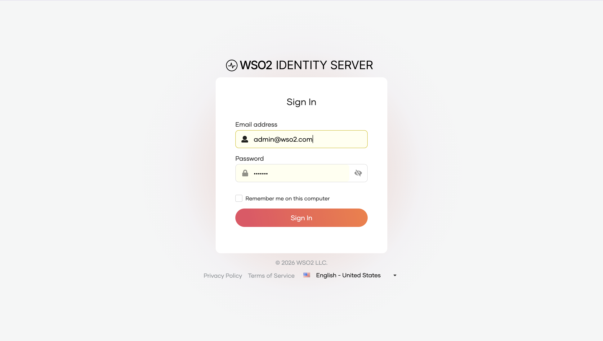
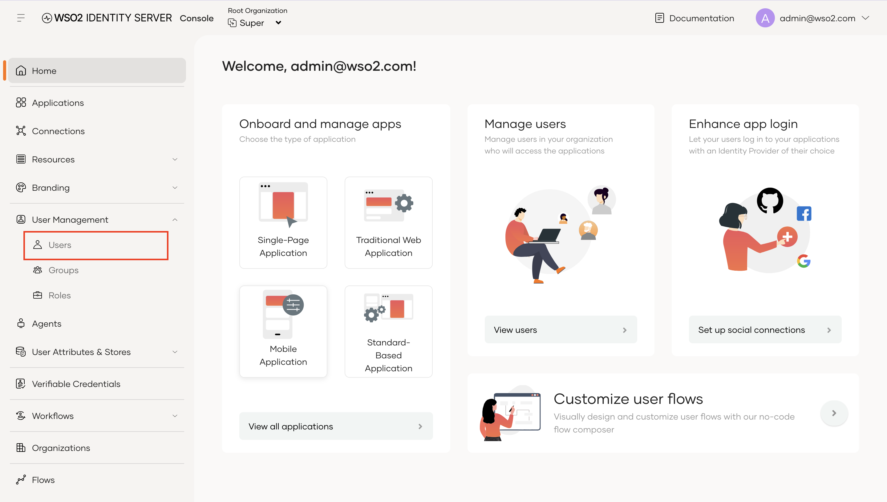
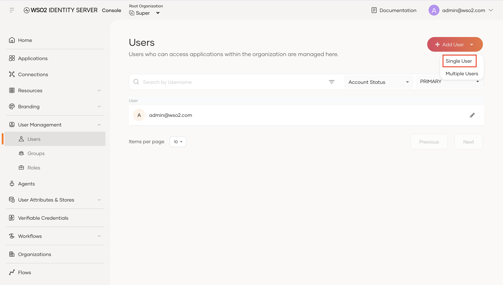
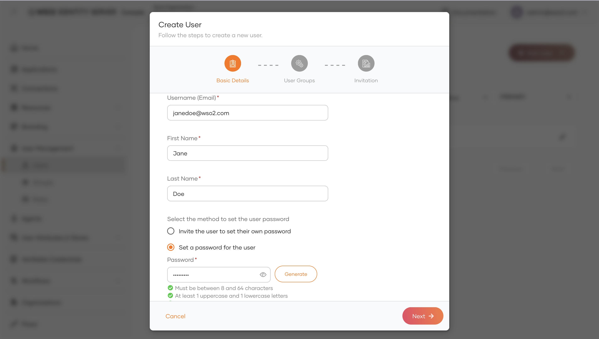
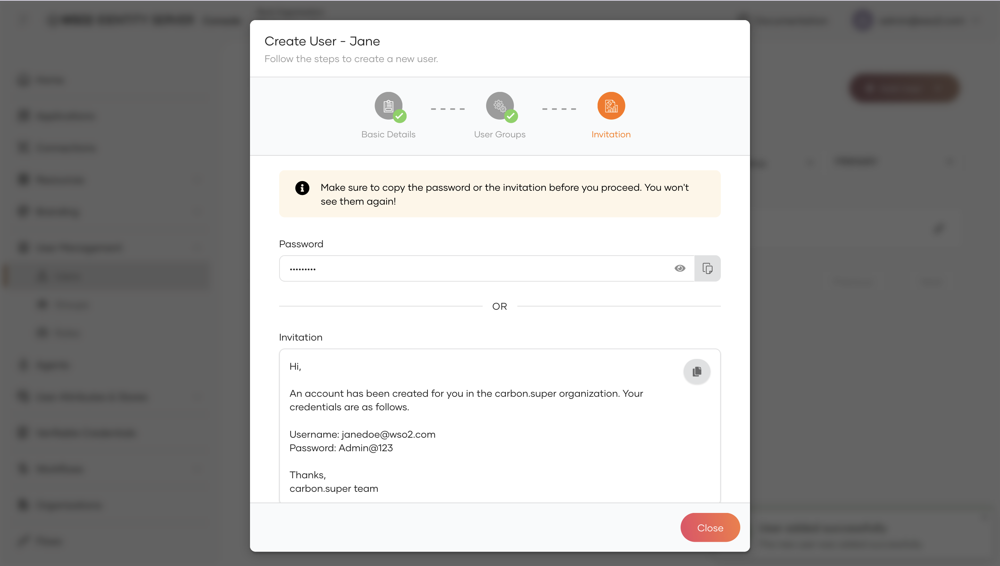
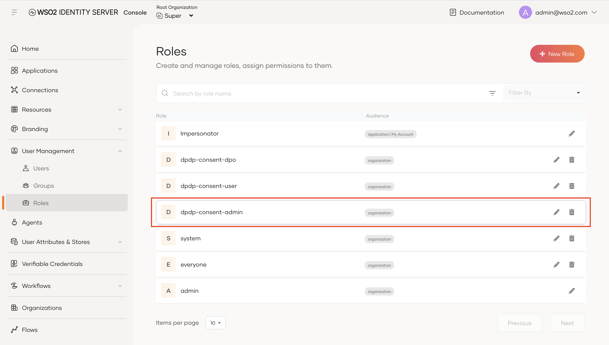
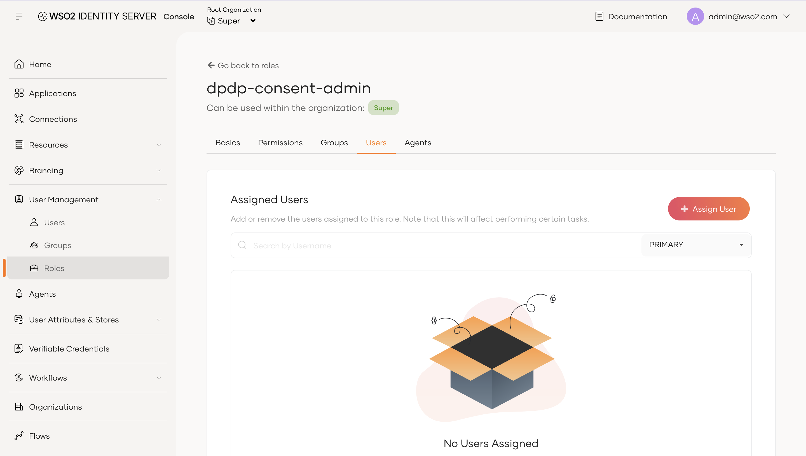
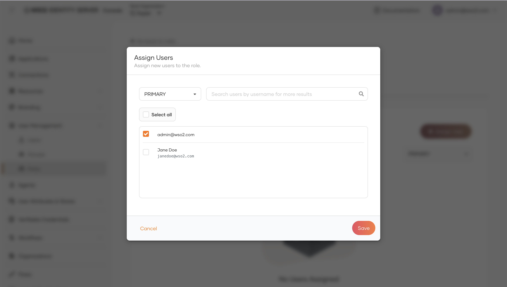

# Configuring Users and Roles

Once WSO2 Identity Server and the DPDP Accelerator are started, the accelerator automatically provisions three predefined roles: `dpdp-consent-admin`, `dpdp-consent-dpo`, and `dpdp-consent-user`. However, **role membership is not assigned automatically**; you must create your users and assign them to the appropriate roles using the WSO2 Identity Server Console.

This guide walks you through:
1. [Creating a new user](#1-creating-a-user)
2. [Assigning accelerator roles](#2-assigning-accelerator-roles)
3. [Understanding accelerator roles](#3-accelerator-roles-overview)

---

## 1. Creating a User

Follow these steps to create a user in the Identity Server Console.

### Step 1: Sign in to the Console

Open your browser and navigate to the WSO2 Identity Server Console:
```text
https://<host>:9443/console
```
Log in with your administrator account (e.g., `admin@wso2.com`).



### Step 2: Navigate to Users

In the left navigation sidebar, expand **User Management** and click **Users**.



### Step 3: Add a new user

On the top-right of the Users page, click **+ Add User** and select **Single User**.



### Step 4: Fill in basic user details

Enter the user's details in the **Basic Details** step:

- **Username (Email):** Enter the user's email address (for example, `janedoe@wso2.com`).

:::info Note
Under the accelerator's default configuration, usernames are email addresses.
:::

- **First Name:** Enter the user's first name (e.g., `Jane`).
- **Last Name:** Enter the user's last name (e.g., `Doe`).
- **Password Method:** Select **Set a password for the user** to specify a password directly, or choose **Invite the user to set their own password** to send an email invitation.
- **Password:** If setting a password directly, enter a password that meets the displayed complexity requirements (or click **Generate**).

Click **Next** to proceed. You can optionally assign user groups on the next step or click **Next** to skip.



### Step 5: Save credentials and finish creation

On the final **Invitation** step:

1. Copy the generated password or invitation credentials for the user.
2. Click **Close** to complete user creation.

:::warning Important
Make sure to copy the temporary password before closing the dialog, as it will not be displayed again.
:::



---

## 2. Assigning Accelerator Roles

After creating the user, assign them to the appropriate DPDP role.

### Step 1: Navigate to Roles

In the left navigation sidebar, expand **User Management** and click **Roles**.

You will see the accelerator's predefined roles:
- `dpdp-consent-admin`
- `dpdp-consent-dpo`
- `dpdp-consent-user`

Select the role you want to assign (for example, click the edit icon on **`dpdp-consent-admin`**).



### Step 2: Open the Users tab

In the role details view:
1. Click the **Users** tab from the top tab menu.
2. Click the **+ Assign User** button.



### Step 3: Select and assign the user

In the **Assign Users** dialog:
1. Search for or locate the user (e.g., `admin@wso2.com` or `janedoe@wso2.com`).
2. Check the box next to the user's name.
3. Click **Save**.



The user is now assigned to the role and can access the corresponding features in the Consent Portal and APIs.

---

## 3. Accelerator Roles Overview

The accelerator provides three predefined roles designed to separate user, administrative, and data protection responsibilities:

| Role | Target Persona | Key Capabilities |
|---|---|---|
| **`dpdp-consent-admin`** | System & Organization Administrators | Full oversight over consents, purpose/element catalog management, tenant-wide complaint management, and event notification subscriptions. |
| **`dpdp-consent-dpo`** | Data Protection Officers (DPO) | Organization-wide complaint inspection, review, internal notes, and complaint resolution without administrative consent privileges. |
| **`dpdp-consent-user`** | Data Principals / End Users | Self-service account deletion (`DELETE /scim2/Me`), personal complaint filing and tracking, and personal consent history audit views. |

:::tip
- **Basic Consent Access:** End users can log into the Consent Portal, view their active consents, and authorize or revoke consents without any role assigned. Assign `dpdp-consent-user` when they need to file complaints, view audit history, or delete their accounts.
- **Administrator Privileges:** Administrators do not automatically inherit `dpdp-consent-user`. If an administrator also requires self-service account deletion, assign both `dpdp-consent-admin` and `dpdp-consent-user`.
:::

For detailed information on permissions and OAuth scopes associated with each role, see the [Role Management Guide](../role-guide.md).
