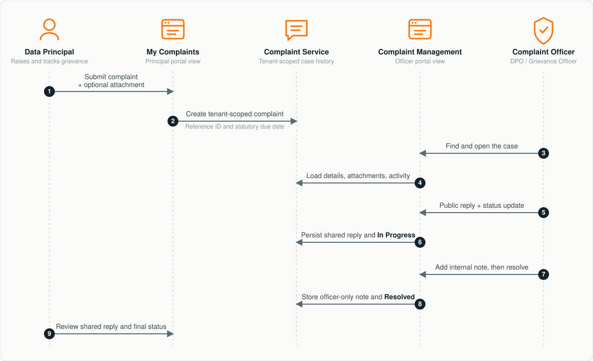

# Try out complaint management

The portal provides separate views for a Data Principal and a complaint
officer. The same case is used to demonstrate submission, attachments, public
and internal communication, status transitions, statutory due dates, and
resolution without requiring a separate client application.



## Submit and resolve a complaint

This flow demonstrates a grievance conversation between a Data Principal and a
complaint officer, including a Data Principal follow-up reply.

**Portal:** The Data Principal uses **My Complaints**. A user holding
`dpdp-consent-dpo` or `dpdp-consent-admin` uses **Complaint Management**. The
API samples mirror the two portal views.

#### Submit the complaint

1. Sign in as the Data Principal.
2. Open **My Complaints** and select **Submit New Complaint**.
3. Choose a category and enter a description that does not include unnecessary
   personal data.
4. Optionally attach one supported PDF, DOCX, PNG, or JPEG file within the
   configured size limit.
5. Submit the complaint and retain the generated reference ID.
6. Open the complaint to inspect its status, statutory due date, shared
   activity, and attachments.

The portal derives the complainant from the access token. Do not send a
`userId` in this self-service request:

```bash
curl -X POST \
  "${BASE_URL}/t/${TENANT_DOMAIN}/api/dpdp/complaints/v1/me/complaints" \
  -H "Authorization: Bearer ${ACCESS_TOKEN}" \
  -H "Content-Type: application/json" \
  -d '{
    "subjectCategory": "DATA_ACCESS_DENIED",
    "description": "I cannot obtain the information associated with my consent."
  }'
```

Representative `201 Created` response:

```json
{
  "id": "fbda5af9-f01b-47c1-8cd6-0268e6562614",
  "referenceId": "CMP-2026-00001",
  "subjectCategory": "DATA_ACCESS_DENIED",
  "priority": "HIGH",
  "status": "OPEN",
  "userId": "portal-user",
  "description": "I cannot obtain the information associated with my consent.",
  "submittedAt": 1788231000000,
  "updatedAt": 1788231000000,
  "statutoryDueDate": 1790823000000
}
```

#### Handle the complaint

1. Sign in as the complaint officer.
2. Open **Complaint Management**.
3. Locate the complaint using its reference ID or the queue search field. The
   queue also supports status and priority filters.
4. Open the case and send a public reply. The Data Principal can see public
   replies and their attachments.
5. Sign back in as the Data Principal, open the complaint, and send a follow-up
   reply. Confirm that it appears in the shared activity timeline.
6. Sign in again as the complaint officer. Add an **Internal Note** and confirm
   that it remains available only in the
   officer view.
7. Use the send action's status menu to move the complaint through one of the
   permitted next states.
8. Select `RESOLVED` when the test conversation is complete and confirm the
   resolution.
9. Sign back in as the Data Principal and verify the shared replies and final
   status. The internal note must not appear.

The officer can send a public response and change status in one request:

```bash
curl -X POST \
  "${BASE_URL}/t/${TENANT_DOMAIN}/api/dpdp/complaints/v1/complaints/<complaint-id>/comments" \
  -H "Authorization: Bearer ${ACCESS_TOKEN}" \
  -H "Content-Type: application/json" \
  -d '{
    "message": "We are reviewing your request.",
    "isPublic": true,
    "toStatus": "IN_PROGRESS"
  }'
```

Representative `200 OK` response:

```json
{
  "id": "4af15889-f1f7-48c9-af02-f8e903b3a573",
  "actorUserId": "complaint-officer",
  "actorRole": "COMPLAINT_OFFICER",
  "message": "We are reviewing your request.",
  "isPublic": true,
  "fromStatus": "OPEN",
  "toStatus": "IN_PROGRESS",
  "createdTime": 1788231600000
}
```

Set `isPublic` to `false` for an internal note. Use the complaint officer's
token for this endpoint; the Data Principal's self-service comment endpoint
does not accept the visibility field.

Expected result: both users see one ordered activity timeline, while internal
officer content remains hidden from the Data Principal. A resolved complaint is
not read-only in the current portal: the Data Principal can still post a
self-service reply, which is recorded while the complaint remains `RESOLVED`.
